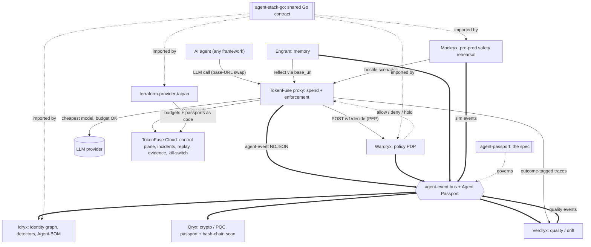

<div align="center">

# terraform-provider-taipan - Governance as Code

**Manage TokenFuse Cloud spend budgets and Agent Passports the same way you already manage the rest of your infrastructure: in version control, PR-reviewed, applied by the same Terraform pipeline your platform team runs everything else through.**

[](https://github.com/TAIPANBOX/terraform-provider-taipan/actions/workflows/ci.yml)


</div>

`terraform-provider-taipan` closes a governance gap: a FinOps or platform team that
runs a bank's cloud infrastructure through Terraform today has to manage AI-agent
budgets and agent identities out of band (a dashboard click here, a curl command
there), with no PR review, no diff, and no audit trail beyond whatever the target
system logs on its own. This provider turns TokenFuse Cloud spend budgets and Agent
Passport documents into plain Terraform resources: reviewed in a PR like an IAM
policy or a security group, planned before they apply, diffed when they drift, and
auditable through the same `terraform plan`/`apply` history as the rest of the
estate. **This is purely defensive tooling**: the provider only configures controls
the operator already owns (their own TokenFuse Cloud org, their own passport
documents); it never reaches into, scans, or takes any action against a third-party
system.

---

## Where this fits in the stack

terraform-provider-taipan is the governance-as-code plane of the TAIPANBOX agent-governance stack: it renders TokenFuse Cloud budgets and Agent Passports as reviewable, PR-gated Terraform resources.



- **Consumes**: Terraform configuration (`taipan_budget`, `taipan_agent_passport`, `taipan_wardryx_policy` resources).
- **Produces**: **TokenFuse Cloud** spend budgets, rendered/validated Agent Passport documents, and **Wardryx** policy-as-code documents.
- **Talks to**: **TokenFuse Cloud** (the `taipan_budget` API), **agent-passport** (validates against `agent-stack-go/passport`'s `Parse`, the same check **Idryx** runs on ingest), **Wardryx** (the `taipan_wardryx_policy` admin `/v1/policies` API); imports **agent-stack-go**.

The full stack is TokenFuse (spend), Wardryx (policy), Engram (memory), Idryx (access), Qryx (crypto), Verdryx (quality), Mockryx (pre-prod), on the shared Agent Passport + agent-event contract (agent-stack-go / agent-passport), configured via terraform-provider-taipan.

Run the whole open stack locally with one command via [**stack-up**](https://github.com/TAIPANBOX/stack-up); the stack's home on the web is [**it-rat.com**](https://it-rat.com).

---

## Resources

<div align="center">

</div>

Three parts of the TAIPANBOX stack are plain Terraform resources today, all reviewed
in a PR, planned before they apply, and diffed when they drift:

| Resource | Status | Calls an API? | Purpose |
| --- | --- | --- | --- |
| `taipan_budget` | shipped | yes (TokenFuse Cloud) | Central spend budget for one run |
| `taipan_agent_passport` | shipped | no (renders a file) | Agent Passport document (`taipanbox.dev/agent-passport/v0.1`) |
| `taipan_wardryx_policy` | shipped | yes (Wardryx) | One Wardryx policy-as-code document, layered on top of Wardryx's own file-loaded policies |

The provider currently exposes no data sources (`Provider.DataSources()` returns an
empty list): read-back today goes through `terraform state`/`refresh`, not a
`data "taipan_..."` block.

### `taipan_budget`

```hcl
resource "taipan_budget" "support_bot" {
  run_id    = "support-bot-2026-07-09"
  limit_usd = 25.00
}
```

- `run_id` (string, required, forces replacement): the run this budget applies to.
  Budgets are keyed by run id in TokenFuse Cloud, so there is no in-place rename.
- `limit_usd` (number, required): the budget in US dollars. Sent to the Cloud API as
  `budget_usd`; the server stores and reports it in microdollars
  (`budget_usd * 1_000_000`), and this provider converts back to dollars for state.

Create and Update both call `POST /v1/runs/{run_id}/budget`, the only endpoint the
Cloud API exposes for this: there is no separate PATCH. Read calls `GET /v1/budgets`
and looks up this run id in the response; if the run no longer has a central budget,
the resource is dropped from state so Terraform plans a recreate instead of reporting
a false "no changes".

**Delete is best-effort and state-only.** TokenFuse Cloud has no budget-delete
endpoint: `crates/cloud/src/http.rs` routes `POST /v1/runs/{run}/budget`
(set/overwrite) and `GET /v1/budgets` (read), and nothing else for budgets. Destroying
a `taipan_budget` resource removes it from Terraform state; the budget itself stays
set in TokenFuse Cloud until something else overwrites it. This is a deliberate
choice, not an oversight: inventing a DELETE call here would 404 against every real
deployment.

### `taipan_agent_passport`

```hcl
resource "taipan_agent_passport" "support_bot" {
  id                  = "agent://acme-bank.example/support/tier1-bot"
  owner               = "team-support@acme-bank.example"
  display_name        = "Tier-1 support bot"
  runtime             = "langgraph"
  attestation_method  = "spiffe-svid"
  attestation_detail  = "spiffe://acme-bank.example/support/tier1-bot"

  labels = {
    env         = "prod"
    cost_center = "cs-eu"
  }

  # Optional: folders this agent is declared to access (SPEC.md §4.4) and the
  # LLM providers/models/endpoints it uses (SPEC.md §4.5). Both are
  # declarations carried on the passport for audit and inventory, not controls
  # this stack enforces at runtime.
  filesystem {
    path = "/data/reports"
    mode = "read"
  }
  filesystem {
    path = "/data/out"
    mode = "write"
  }

  models {
    provider = "anthropic"
    model    = "claude-sonnet-4-5"
    endpoint = "api.anthropic.com"
  }

  output_path = "${path.module}/passports/tier1-bot.json"
}
```

This resource calls no API. A passport is a small, static JSON document, not a
server-managed object; Idryx and Qryx read it from disk. Create and Update render and
validate the document, reusing `agent-stack-go/passport`'s `Parse` verbatim (the exact
validation Idryx runs on ingest), so a `taipan_agent_passport` that applies cleanly is
guaranteed to parse cleanly through Idryx too. If `output_path` is set, the rendered
document is written there at file mode `0600`; Delete removes that file, if any.

The rendered document is also available as the computed `json` attribute, for piping
into another resource. Rendering is deterministic: struct fields marshal in a fixed
declared order and `labels` (a Go map) is serialized with sorted keys, both guaranteed
by `encoding/json`, so the same input always produces byte-identical output.

Fields: `id` (the `agent://` URI, required, forces replacement, validated with
`ValidateAgentURI`), `owner` (required), `display_name` / `runtime` / `parent` /
`attestation_method` / `attestation_detail` (all optional), `labels` (optional
`map(string)`), `output_path` (optional). `attestation_detail` is an unconstrained
string (agent-passport/SPEC.md §4.3: e.g. a SPIFFE ID for `spiffe-svid`, an issuer
URL for `oidc`); it is only rendered when `attestation_method` is also set, and
omitted from the document entirely otherwise.

Two optional repeatable blocks carry the newer Agent Passport arrays, rendered
as the document's root-level `filesystem` and `models` (agent-passport/SPEC.md
§4.4-4.5), and matching the `filesystem {}` / `models {}` blocks the Genaryx
onboard wizard generates: `filesystem { path mode }` (both required; `mode` is
`read` or `write`) declares a folder the agent accesses, and
`models { provider model endpoint }` (only `provider` required) declares an LLM
provider/model/endpoint it uses. Both are declarations carried on the passport
for audit and inventory, not controls this stack enforces at runtime; each is
omitted from the rendered document when no blocks are set, so a passport
declaring neither renders byte-for-byte as before these blocks existed.

### `taipan_wardryx_policy`

```hcl
resource "taipan_wardryx_policy" "ops_guard" {
  id     = "ops-guard"
  target = "agent://acme-bank.example/ops/*"

  deny_tool               = ["shell_exec"]
  allow_domains           = ["good.example.com"]
  require_human_above_usd = 500
  deny_above_usd          = 5000
  max_steps               = 40
  deny_if_unattested      = true
}
```

Manages one Wardryx admin policy-as-code document via `PUT`/`GET`/`DELETE
/v1/policies/{id}`, on top of the operator's own Wardryx deployment. This is
layered, not exclusive: Wardryx's own `-policy`/`WARDRYX_POLICY` file-loaded
rules stay a permanent floor no `taipan_wardryx_policy` write can remove, and
those file-loaded rules aren't manageable through this resource at all (they
carry no `id`) -- see Wardryx's own README, "Policy-as-code". Create and
Update both call `PUT /v1/policies/{id}`, Wardryx's own upsert endpoint;
Read calls `GET /v1/policies/{id}` and drops the resource from state if the
policy is gone (deleted out of band), so Terraform plans a recreate instead
of a false "no changes". **Unlike `taipan_budget`, this Delete is real**:
Wardryx's policy API has an actual `DELETE /v1/policies/{id}`, so destroying
this resource removes the rule from Wardryx, not just from Terraform state.

Fields: `id` (the policy id, e.g. `ops-guard`, required, forces replacement --
Wardryx addresses policies by id, not name, and there is no rename) and
`target` (the `agent://` glob, required) are the only required attributes.
`name` / `deny_tool` / `allow_domains` / `require_human_above_usd` /
`deny_above_usd` / `max_steps` / `deny_if_unattested` are all optional,
mirroring `policy.Policy`'s fields in the wardryx repo one-for-one; each has
a matching zero-value default (`""` / `[]` / `0` / `false`), since Wardryx's
own wire format can't distinguish an explicitly-set zero value from an
omitted one (`omitempty`) and a mismatched default would otherwise make
every plan for an unconfigured field fail with "provider produced
inconsistent result". `updated_at` is computed: the RFC 3339 timestamp of
this policy's last write, as reported by Wardryx.

---

## Provider configuration

```hcl
provider "taipan" {
  cloud_url   = "https://cloud.tokenfuse.example" # or TOKENFUSE_CLOUD_URL
  cloud_key   = var.tokenfuse_cloud_key           # or TOKENFUSE_CLOUD_KEY
  wardryx_url = "https://wardryx.acme.example"    # or WARDRYX_URL
  wardryx_key = var.wardryx_admin_key             # or WARDRYX_KEY
}
```

| Attribute | Env fallback | Notes |
| --- | --- | --- |
| `cloud_url` | `TOKENFUSE_CLOUD_URL` | Base URL of the TokenFuse Cloud control plane. Needed by `taipan_budget`. |
| `cloud_key` | `TOKENFUSE_CLOUD_KEY` | Sensitive. Sent as `Authorization: Bearer <cloud_key>`. `taipan_budget` mutations need an admin-role key; the bearer format is `key:org[:role]`. |
| `wardryx_url` | `WARDRYX_URL` | Base URL of the operator's Wardryx deployment. Needed by `taipan_wardryx_policy`. |
| `wardryx_key` | `WARDRYX_KEY` | Sensitive. Sent as `Authorization: Bearer <wardryx_key>` -- just the key segment of one `WARDRYX_KEYS` entry (`key:org:role`), not the full triple. `taipan_wardryx_policy` requires the key's role to be admin. |

All four are optional at the provider level and validated lazily, per resource type:
a passport-only configuration needs none of them, a budget-only configuration only
needs `cloud_url`/`cloud_key`, and so on. Each resource's own `Configure` reports a
single clear diagnostic ("Missing TokenFuse Cloud configuration" / "Missing Wardryx
configuration") the first time it is actually touched with its pair unset, rather than
the provider failing unconditionally for every resource regardless of which one a
given configuration actually uses.

---

## Governance as code, the loop

<div align="center">

</div>

The loop is the same one a platform team already runs for every other resource type:
author the HCL, `terraform plan` shows the diff against live state (TokenFuse Cloud
budgets, passport files on disk), `terraform apply` reconciles reality to match the
declared configuration, and if anything changes out of band afterward (a dashboard
click, a direct API call), the next `terraform plan` reads live state again, shows
the delta, and `apply` reconciles it back. No side channel survives the next
plan/apply: budgets and passports stop being a place configuration can silently
drift.

---

## Install

`terraform-provider-taipan` is not yet published to the Terraform Registry (no tags
or releases yet), so the `required_providers` source in
[`examples/main.tf`](examples/main.tf) will not resolve with a plain `terraform
init`. Until the first release, build from source and point Terraform at that local
build with a dev override instead.

```sh
git clone https://github.com/TAIPANBOX/terraform-provider-taipan
cd terraform-provider-taipan
go build -o terraform-provider-taipan .
```

Then add a dev override to `~/.terraformrc`:

```hcl
provider_installation {
  dev_overrides {
    "TAIPANBOX/taipan" = "/path/to/terraform-provider-taipan"
  }
  direct {}
}
```

Point the path at the directory containing the binary you just built. With
`dev_overrides` active, `terraform init` is skipped for this provider, and
`terraform plan`/`apply` use the local build directly.

## Example

See [`examples/main.tf`](examples/main.tf) for a complete provider block plus one of
each resource.

## Development

```sh
make build   # go build -> bin/terraform-provider-taipan
make test    # go test -race ./...
make testacc # TF_ACC acceptance tests against real, disposable local backends
make lint    # go vet + staticcheck + gofmt -l
make govulncheck
make gosec
```

CI (`.github/workflows/ci.yml`) runs `gofmt`, `go vet`, `staticcheck`, `go test -race`,
`go build` in a `build` job, `govulncheck` + `gosec -quiet` in a `security` job, and the
`TF_ACC` acceptance tests below in a third `acceptance` job, mirroring the rest of the
TAIPANBOX Go stack (see Idryx) for the first two.

`go test -race ./...` (what `make test` and the `build` job both run) needs neither a
real Terraform binary nor a live TokenFuse Cloud/Wardryx: the `taipan_agent_passport`
render/validate logic is unit-tested directly, and both `taipan_budget`'s and
`taipan_wardryx_policy`'s HTTP calls are tested against an `httptest` mock server that
asserts the exact request/response shapes read out of `crates/cloud/src/http.rs` and
wardryx's `internal/api`, respectively (method, path, headers, body shape, and the
not-found/error-response cases each resource's Read/Delete branch on).

### Acceptance tests (`TF_ACC`)

`TestAccBudgetResource` and `TestAccWardryxPolicyResource`
(`internal/provider/budget_resource_test.go`,
`internal/provider/wardryx_policy_resource_test.go`) drive the real provider over the
actual Terraform protocol v6 wire, via `terraform-plugin-testing`, exercising the
`tfsdk.Plan`/`State` handling inside each resource's Create/Read/Update/Delete that the
`httptest`-mock unit tests above deliberately don't reach. Both are gated on `TF_ACC`
(Terraform's own opt-in convention: unset, `go test ./...` reports them as `SKIP`, never
`FAIL`) plus a live backend, so they never affect the `build` job or a plain `go test`.

Each resource's `CheckDestroy` asserts what that resource's own `Delete` actually does,
not a generic "is it gone" check: `taipan_budget`'s asserts the budget survives (Delete
is state-only, see its own doc comment), `taipan_wardryx_policy`'s asserts a real 404
(Delete calls a real `DELETE`).

Run them against real, disposable local instances with:

```sh
make testacc   # == ./scripts/testacc-local.sh
```

This builds and starts a real `tokenfuse-cloud` (`cargo run -p tokenfuse-cloud`) and a
real `wardryx serve` from sibling checkouts (`../tokenfuse`, `../wardryx` by default;
override with `TOKENFUSE_REPO_DIR` / `WARDRYX_REPO_DIR`), waits for both `/healthz`,
points `TF_ACC=1` and the four `TOKENFUSE_CLOUD_*`/`WARDRYX_*` env vars at them, runs
`go test -run '^TestAcc'`, and always tears both processes down again on exit, success
or failure. The `acceptance` CI job runs this exact script unmodified, checking out
`TAIPANBOX/tokenfuse` and `TAIPANBOX/wardryx` alongside this repo first (all three are
public, so this needs no cross-repo secret or PAT).

Writing these against a real backend, rather than assuming the SDKv2-era acceptance-test
conventions apply unchanged, surfaced two real gaps the `httptest`-mock unit tests could
not have caught: neither `taipan_budget` nor (implicitly) `taipan_wardryx_policy` has an
`id` attribute the test framework's `ImportStateVerify` defaults to, so both need
`ImportStateId` set explicitly (`taipan_budget` additionally needs
`ImportStateVerifyIdentifierAttribute: "run_id"`, since it has no `id` at all); and
Wardryx's `updated_at` has only second-level granularity (`time.RFC3339`, no fractional
seconds), so a Create immediately followed by an Update in the same test process can
land in the same wall-clock second, requiring a short `PreConfig` sleep before asserting
`updated_at` actually changed.

---

## Status

- [x] `taipan_budget`: central TokenFuse Cloud spend budget, create/update/read/best-effort delete
- [x] `taipan_agent_passport`: rendered, validated Agent Passport document, optional on-disk output
- [x] `taipan_wardryx_policy`: Wardryx policy-as-code document, create/update/read/real delete, layered on Wardryx's own file-loaded policies
- [x] CI: gofmt, vet, staticcheck, race tests, build, govulncheck, gosec
- [x] `TF_ACC`-gated acceptance tests against a live TokenFuse Cloud / Wardryx (`make testacc`, `scripts/testacc-local.sh`, CI `acceptance` job)
- [x] `attestation_detail` attribute for detail-bearing attestation methods (`spiffe-svid`, `oidc`)
- [x] `filesystem` / `models` blocks on `taipan_agent_passport` for declared folder access and LLM providers/models/endpoints (agent-passport SPEC.md §4.4-4.5), matching the Genaryx onboard wizard's generated Terraform

## License

Apache-2.0, see [LICENSE](LICENSE).
