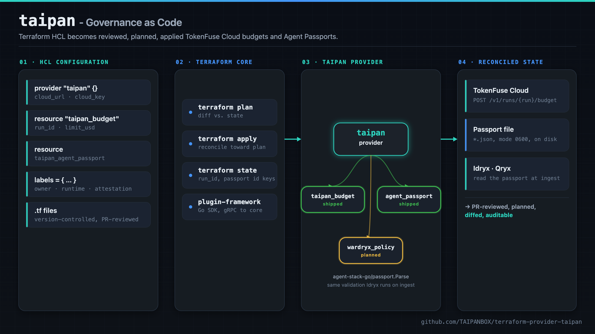
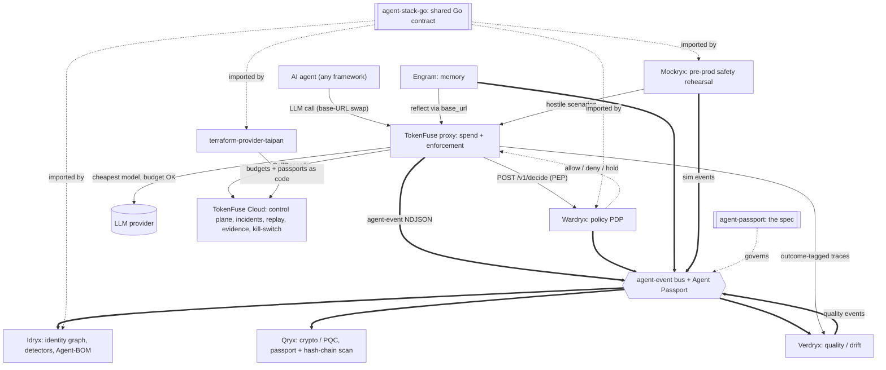
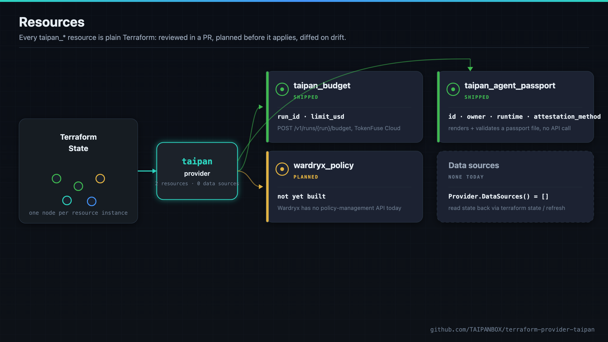
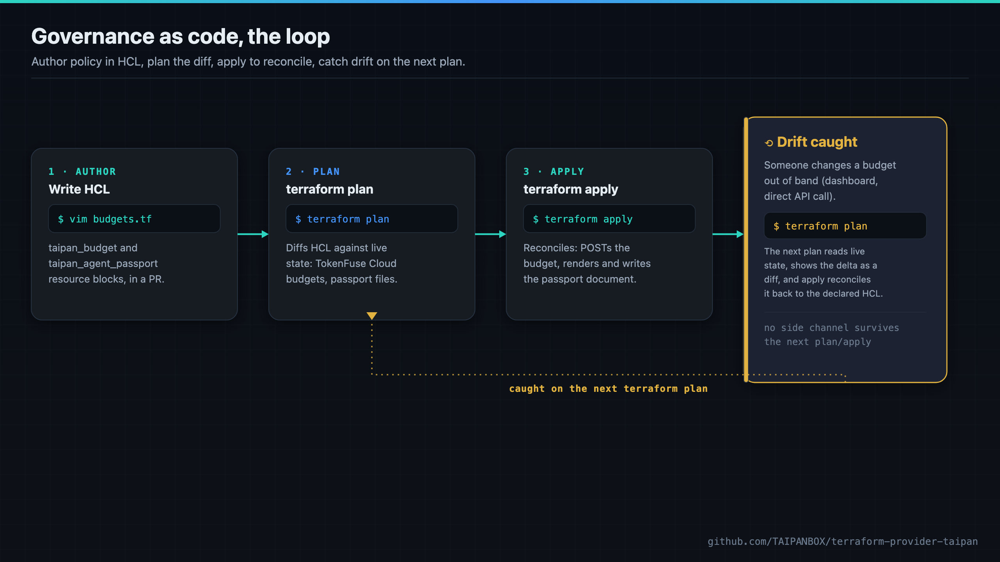

<div align="center">

# terraform-provider-taipan - Governance as Code

**Manage TokenFuse Cloud spend budgets and Agent Passports the same way you already manage the rest of your infrastructure: in version control, PR-reviewed, applied by the same Terraform pipeline your platform team runs everything else through.**

[](https://github.com/TAIPANBOX/terraform-provider-taipan/actions/workflows/ci.yml)




</div>

`terraform-provider-taipan` closes a governance gap: a FinOps or platform team that
runs a bank's cloud infrastructure through Terraform today has to manage AI-agent
budgets and agent identities out of band (a dashboard click here, a curl command
there), with no PR review, no diff, and no audit trail beyond whatever the target
system logs on its own. This provider turns TokenFuse Cloud spend budgets and Agent
Passport documents into plain Terraform resources: reviewed in a PR like an IAM
policy or a security group, planned before they apply, diffed when they drift, and
auditable through the same `terraform plan`/`apply` history as the rest of the
estate. **This is purely defensive tooling**: the provider only configures controls
the operator already owns (their own TokenFuse Cloud org, their own passport
documents); it never reaches into, scans, or takes any action against a third-party
system.

---

## Where this fits in the stack

terraform-provider-taipan is the governance-as-code plane of the TAIPANBOX agent-governance stack: it renders TokenFuse Cloud budgets and Agent Passports as reviewable, PR-gated Terraform resources.



- **Consumes**: Terraform configuration (`taipan_budget`, `taipan_agent_passport` resources).
- **Produces**: **TokenFuse Cloud** spend budgets and rendered, validated Agent Passport documents.
- **Talks to**: **TokenFuse Cloud** (the `taipan_budget` API), **agent-passport** (validates against `agent-stack-go/passport`'s `Parse`, the same check **Idryx** runs on ingest); imports **agent-stack-go**.

The full stack is TokenFuse (spend), Wardryx (policy), Engram (memory), Idryx (access), Qryx (crypto), Verdryx (quality), Mockryx (pre-prod), on the shared Agent Passport + agent-event contract (agent-stack-go / agent-passport), configured via terraform-provider-taipan.

---

## Resources

<div align="center">

</div>

Two parts of the TAIPANBOX stack are plain Terraform resources today, both reviewed
in a PR, planned before they apply, and diffed when they drift:

| Resource | Status | Calls an API? | Purpose |
| --- | --- | --- | --- |
| `taipan_budget` | shipped | yes (TokenFuse Cloud) | Central spend budget for one run |
| `taipan_agent_passport` | shipped | no (renders a file) | Agent Passport document (`taipanbox.dev/agent-passport/v0.1`) |
| `wardryx_policy` | planned | n/a | Not built yet: Wardryx has no policy-management API today, and its policy types are internal. Tracked for a future release once that API exists. |

The provider currently exposes no data sources (`Provider.DataSources()` returns an
empty list): read-back today goes through `terraform state`/`refresh`, not a
`data "taipan_..."` block.

### `taipan_budget`

```hcl
resource "taipan_budget" "support_bot" {
  run_id    = "support-bot-2026-07-09"
  limit_usd = 25.00
}
```

- `run_id` (string, required, forces replacement): the run this budget applies to.
  Budgets are keyed by run id in TokenFuse Cloud, so there is no in-place rename.
- `limit_usd` (number, required): the budget in US dollars. Sent to the Cloud API as
  `budget_usd`; the server stores and reports it in microdollars
  (`budget_usd * 1_000_000`), and this provider converts back to dollars for state.

Create and Update both call `POST /v1/runs/{run_id}/budget`, the only endpoint the
Cloud API exposes for this: there is no separate PATCH. Read calls `GET /v1/budgets`
and looks up this run id in the response; if the run no longer has a central budget,
the resource is dropped from state so Terraform plans a recreate instead of reporting
a false "no changes".

**Delete is best-effort and state-only.** TokenFuse Cloud has no budget-delete
endpoint: `crates/cloud/src/http.rs` routes `POST /v1/runs/{run}/budget`
(set/overwrite) and `GET /v1/budgets` (read), and nothing else for budgets. Destroying
a `taipan_budget` resource removes it from Terraform state; the budget itself stays
set in TokenFuse Cloud until something else overwrites it. This is a deliberate
choice, not an oversight: inventing a DELETE call here would 404 against every real
deployment.

### `taipan_agent_passport`

```hcl
resource "taipan_agent_passport" "support_bot" {
  id                  = "agent://acme-bank.example/support/tier1-bot"
  owner               = "team-support@acme-bank.example"
  display_name        = "Tier-1 support bot"
  runtime             = "langgraph"
  attestation_method  = "spiffe-svid"

  labels = {
    env         = "prod"
    cost_center = "cs-eu"
  }

  output_path = "${path.module}/passports/tier1-bot.json"
}
```

This resource calls no API. A passport is a small, static JSON document, not a
server-managed object; Idryx and Qryx read it from disk. Create and Update render and
validate the document, reusing `agent-stack-go/passport`'s `Parse` verbatim (the exact
validation Idryx runs on ingest), so a `taipan_agent_passport` that applies cleanly is
guaranteed to parse cleanly through Idryx too. If `output_path` is set, the rendered
document is written there at file mode `0600`; Delete removes that file, if any.

The rendered document is also available as the computed `json` attribute, for piping
into another resource. Rendering is deterministic: struct fields marshal in a fixed
declared order and `labels` (a Go map) is serialized with sorted keys, both guaranteed
by `encoding/json`, so the same input always produces byte-identical output.

Fields: `id` (the `agent://` URI, required, forces replacement, validated with
`ValidateAgentURI`), `owner` (required), `display_name` / `runtime` / `parent` /
`attestation_method` (all optional), `labels` (optional `map(string)`), `output_path`
(optional). There is no `attestation_detail` attribute yet: `attestation_method` alone
covers `none`, but a detail-bearing method like `spiffe-svid` or `oidc` needs a
follow-up attribute before it carries a real reference.

---

## Provider configuration

```hcl
provider "taipan" {
  cloud_url = "https://cloud.tokenfuse.example" # or TOKENFUSE_CLOUD_URL
  cloud_key = var.tokenfuse_cloud_key            # or TOKENFUSE_CLOUD_KEY
}
```

| Attribute | Env fallback | Required | Notes |
| --- | --- | --- | --- |
| `cloud_url` | `TOKENFUSE_CLOUD_URL` | yes | Base URL of the TokenFuse Cloud control plane. |
| `cloud_key` | `TOKENFUSE_CLOUD_KEY` | yes | Sensitive. Sent as `Authorization: Bearer <cloud_key>`. `taipan_budget` mutations need an admin-role key; the bearer format is `key:org[:role]`. |

Both are required at `Configure` time, even for a passport-only configuration: this
keeps the failure mode a single clear diagnostic on `terraform plan`, instead of a
confusing error the first time a `taipan_budget` resource is touched.

---

## Governance as code, the loop

<div align="center">

</div>

The loop is the same one a platform team already runs for every other resource type:
author the HCL, `terraform plan` shows the diff against live state (TokenFuse Cloud
budgets, passport files on disk), `terraform apply` reconciles reality to match the
declared configuration, and if anything changes out of band afterward (a dashboard
click, a direct API call), the next `terraform plan` reads live state again, shows
the delta, and `apply` reconciles it back. No side channel survives the next
plan/apply: budgets and passports stop being a place configuration can silently
drift.

---

## Example

See [`examples/main.tf`](examples/main.tf) for a complete provider block plus one of
each resource.

## Development

```sh
make build   # go build -> bin/terraform-provider-taipan
make test    # go test -race ./...
make lint    # go vet + staticcheck + gofmt -l
make govulncheck
make gosec
```

CI (`.github/workflows/ci.yml`) runs `gofmt`, `go vet`, `staticcheck`, `go test -race`,
`go build` in one job and `govulncheck` + `gosec -quiet` in a second, mirroring the
rest of the TAIPANBOX Go stack (see Idryx).

Tests need neither a real Terraform binary nor a live TokenFuse Cloud: the
`taipan_agent_passport` render/validate logic is unit-tested directly, and
`taipan_budget`'s HTTP calls are tested against an `httptest` mock server that asserts
the exact request/response shapes read out of `crates/cloud/src/http.rs`. There are no
`terraform-plugin-testing` acceptance tests in this repo yet: the unit tests above
already exercise every CRUD code path (Create/Update/Read both funnel through the same
helpers the tests call directly), and skipping the acceptance-test dependency keeps CI
fully offline and the dependency tree smaller. `TF_ACC`-gated acceptance tests can be
added later without disturbing this structure.

---

## Status

- [x] `taipan_budget`: central TokenFuse Cloud spend budget, create/update/read/best-effort delete
- [x] `taipan_agent_passport`: rendered, validated Agent Passport document, optional on-disk output
- [x] CI: gofmt, vet, staticcheck, race tests, build, govulncheck, gosec
- [ ] `wardryx_policy`, once Wardryx has a policy-management API
- [ ] `TF_ACC`-gated acceptance tests against a live TokenFuse Cloud
- [ ] `attestation_detail` attribute for detail-bearing attestation methods (`spiffe-svid`, `oidc`)

## License

Apache-2.0, see [LICENSE](LICENSE).
